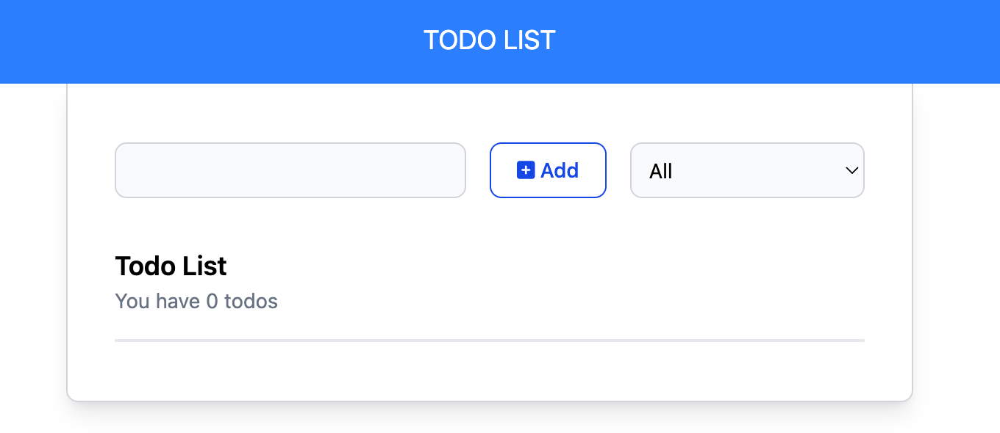
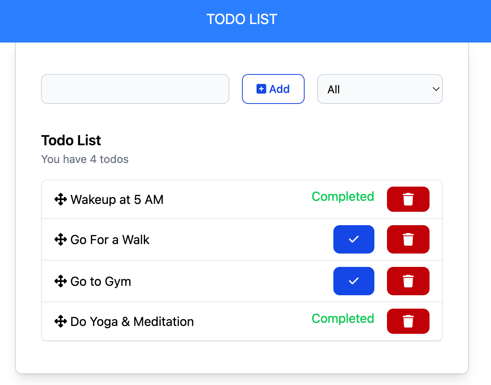

# Todo List App => React + TypeScript + Vite

This is an basic todo list application. Application build using React, TypeScript.

# Feature and Notable points of the application

- Build with vite builder
- Use of TypeScript to make sure a variable and function types should consistance
- Localstore to store the list
- SortableJs module use to add drag and drop sorting.

